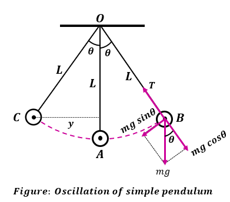

# **Pêndulo Simples**

**Projeto final de Física I escrito em JavaScript**

---

## **1. Objetivo**

Desenvolver uma simulação interativa de um pêndulo simples que ilustre em tempo real suas propriedades físicas, facilitando a compreensão do movimento oscilatório.

---

## **2. Conceitos Chave**

### **O que é um Pêndulo Simples?**

Um pêndulo simples é composto por:  
- Uma **massa pontual (bob)** suspensa por um fio.  
- Um **ponto fixo de suspensão**, permitindo oscilações em um plano.

**Premissas Consideradas:**  
1. O fio é **sem massa** e **inextensível**.  
2. O movimento ocorre sob uma **força gravitacional constante**.  
3. **Resistência do ar é desconsiderada**.

### **O pêndulo:**

---

## **3. Equação do Movimento**

A dinâmica do pêndulo é descrita pela equação diferencial:  

- Para **pequenas oscilações** (\( \sin(\theta) \approx \theta \)):  

Essa simplificação caracteriza um **movimento harmônico simples (MHS)**, com oscilações periódicas em torno da posição de equilíbrio.

---

## **4. Relações e Fatores Influentes**

### **Comprimento do Fio (\(L\))**
- O comprimento \(L\) é **inversamente proporcional** à frequência.  
- **Efeitos:**  
  - Aumentar \(L\) => **aumento no período (\(T\))**.  
  - Diminuir \(L\) => **redução no período (\(T\))**.  
- **Fórmula do Período:**  

### **Aceleração Gravitacional (\(g\))**
- A aceleração gravitacional (\(g\)) afeta diretamente a **velocidade da oscilação**.  
- **Efeitos:**  
  - Aumentar \(g\) => ciclos **mais rápidos**.  
  - Reduzir \(g\) => ciclos **mais lentos**.

### **Amplitude (\(θ₀\))**
- O **ângulo inicial (\(θ₀\))** influencia a altura inicial.  
- **Efeitos:**  
  - Para \(θ₀ < 15°\): Movimento harmônico simples, período constante.  
  - Para \(θ₀ > 15°\): Movimento **não linear**, período aumenta levemente.

### **Massa (\(m\))**
- A **massa não afeta o período**, pois a força gravitacional e a inércia escalam proporcionalmente.

---

## **5. Aplicações Práticas**

### **Exemplos no Dia a Dia**
1. **Cronometragem:**  
   Relógios de pêndulo utilizam períodos constantes para medir o tempo.  
2. **Engenharia:**  
   O princípio do pêndulo é usado em bolas de demolição para eficiência de impacto.  
3. **Sismologia:**  
   Dispositivos pendulares detectam e medem movimentos sísmicos.  
4. **Ensino de Física:**  
   Experimentos para calcular a aceleração gravitacional local (\(g\)).

---

## **6. Conclusão**

O projeto é uma aplicação prática dos conceitos de oscilação e dinâmica, proporcionando uma ferramenta interativa para explorar as propriedades do pêndulo simples. A simulação reforça o entendimento teórico por meio de visualizações em tempo real.

---

## **Referências**
- [1] Livros de Física Básica (adicione aqui as fontes específicas usadas).  
- [2] Manuais de desenvolvimento em JavaScript.

